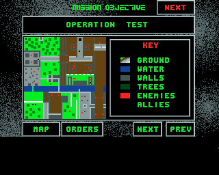

Some of the releases of _Task Force_ have fragments of deleted files toward the
end of the disk, which can be recovered using a tool like DiskSalv. They consist
of earlier versions of some of the game's source code and files.

### File list

The following files can be recovered. On some distributions, such as
compilations and the CU Amiga coverdisk, these are not available.

    MISSION1
    ST-PTPlay.s
    TF-Armour.gfx
    TF-Instructs.s
    TF-Key.gfx
    TF-Main.s
    TF-Masktiles.gfx
    TF-Masktiles2.gfx
    TF-Panel2.gfx
    TF-Paneledge.gfx
    TF-Panelweps.gfx
    TF-Tiles.gfx
    mod.ingame

There are two slight variants in distribution. The PD Soft release and 17 Bit
Software release both have `TF-Panelweps.gfx` recoverable, but not `MISSION1`.
One other version found on TOSEC has `MISSION1` but not `TF-Panelweps.gfx`.

What I suspect happened is that, like some of his other games (including
_The Challenge of the Matrix_, _Spectrum_, _One on One_, _Arazmax_, _Roton_,
_Turbo Thrust_, _Firefly_, and _Overlander_), the author originally included the
source code on the disk. However, with the inclusion of the intro, it would no
longer fit, and the source had to be deleted from the disk.

Without the intro or the intro music file, the game takes up 304 KB and its
source takes up 448 KB, a total of 752 KB, which would fit on an 880 KB disk
with about 128 KB to spare. However, the intro is 208 KB, so its inclusion would
have made it necessary to delete the source code from the disk, leaving
recoverable fragments behind.

### Differences with final version

In nearly all cases the files are identical to those in the officially released
source code, meaning that the final game would be the same. The only differences
are the files `MISSION1`, `TF-Main.s`, and `TF-Instructs.s`.

`TF-Main.s` is the assembly source code file which covers most of the main
program. `TF-Instructs.s` is the code for the Instructions pages. They are
mostly the same as finished release, suggesting the game was nearly complete at
this point, but there are a few differences.

### TF-Instructs.s

In the early Instructions file, the credits have not been added for the game's
intro, suggesting that it was added late in the game. It credits Steve Packer
for the intro and the game's main developer Mark Sheeky for the intro music.

Instructions are also added for the keyboard controls: `M` to toggle the map
during play (a good usability improvement), and `S` to toggle the music. The
total Instructions pagecount number is increased to from 30 to 32 to account for
the changes.

A reference to the `missiongfx` suggests that the file `TF-Missionscreen.pack`
increased in filesize, from 9,357 bytes in the old version to 9,691 in the final
version. It's a rudimentary compression method for files beginning with the
magic numbers `SC01`, a reference no doubt to developer Scorpius.

### TF-Main.s

The first change between the old version of this file and the final version is
several lines of code handling the Map toggle and Music toggle keys. The added
functions are for clearing the main play area, drawing the map, and printing the
soldiers' locations on the map.

In the finished version, a delay of 40 is added after a non-explosive weapon is
fired. Normally, a delay of 30 is added after moving or firing; this 40 delay is
in addition to that. The delay function works by checking `$DFF004`, `VPOSR`, or
the Amiga's CRT vertical beam position, meaning that the function is based on
the fixed screen refresh rate instead of CPU speed. A comment notes that this is
the coder's third version of the function, and was designed for that reason;
presumably earlier versions were CPU-based delays which ran more quickly on
faster Amigas.

The other difference is the addition of key inputs for the map and music toggle
functions, which are defined separately in both move phase and fire phase. The
fire phase was incorrectly commented "keyboard equivs for move phase" in the old
version, probably due to copy-pasted code, but this comment was fixed in the
final version.

### MISSION1

`MISSION1` is an old or test variant of `Mission1`. The map layout is identical
to Operation Spring. The mission title is changed to Operation Test, and the
description is blank.

The other difference is that three of the five soldiers start in different
locations.

{:width=640px height=512px} Operation Test
{:.center}

Two appear in the usual position at the bottom-left of the map behind the fence.
One is at the very top-left of the map, perhaps to test edge detection. One is
down and right a little from that, at the entrance to the the fortified area
with two enemies. The other is near the helipad at the top of the map, perhaps
to test leaving the map. The one in the middle of the map is the hostage.
