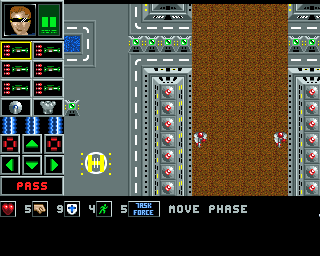
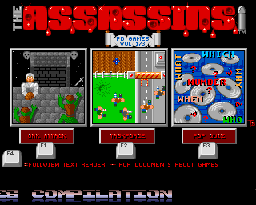

{:.right}

_Task Force_ is a tactical squad based strategy game released around 1994 for
the Commodore Amiga. Like many Amiga games of that era, it was created by a
single author and freely distributed on floppy disk via public domain
distribution companies.

### Development

_Task Force_ was written entirely in 68k assembly language by Mark Sheeky.
[This interview](https://www.amigapd.com/interview-mark-sheeky.html) suggests it
was some version of the HiSoft Devpac assembler in particular, originally known
as GenAm.

Aside from the Protracker play routine, which I assume is an external library,
the game uses 4,549 lines of code, or 3,652 if we want to ignore blank lines and
comments. For comparison, [K240](https://tetracorp.github.io/k240/) is about
40,000 lines, around ten times as many. _Task Force_ included about 160KB of
graphics, 100KB of sound, and two pieces of music, all produced by Sheeky
himself.

From the order of the map tiles, we might speculate that mines were in the game
from early on, then doors may have been added later, then field obstacles like
fences and trees, and rescuable prisoners last of all. However, the tile order
may be entirely arbitrary.

This was the author's tenth Amiga game or so since 1991.

### Release

_Task Force_ is variously stated online to have been released in 1993 or 1994,
and to be either freeware or shareware. I'll try to narrow down the date here.

It was distributed both on a CU Amiga coverdisk, and on various Public Domain
disk releases. While the author remembers on the Itch.io page that it was a
shareware game which received no purchases, in fact the game never mentioned
shareware or a registration fee. It had no external readme file, and while the
in-game documentation invited players to write to express their interested in a
"full" version of the game, no price was listed and no such version was ever
made.

Like many Amiga games, the file dates in _Task Force_ are unreliable for dating
the game's production. The lack of a real-time clock in the most popular Amiga
models often resulted in inaccurate dates, such as 1 Jan 1978. _Task Force_ is
different in that, bizarrely, its files are set the future date of 17 Oct 2020.

As we will see from the known releases, the game must have been released between
late 1993 and early 1994, probably within the range Sept 1993 and Apr 1994.

### Known releases

 _Assassins Games #173_
{:.right}

_Task Force_ appeared on _Assassins Games #173_, a compilation of three games
with Ork Attack and Pop-Quiz. Screenshots were not as easy back then, so the
menu screen actually redraws a scene from the game from scratch. To fit on the
disk, it is compressed with CrunchMania Normal, to 136,564 bytes. The game has
credits for the intro, but the intro do not appear on this disk due to space
constraints.

_Assassins Games #173_ gives a clue that the game may have been first released
in 1993. The compressed version of the main game executable is dated
29 Sept 1993. This date is not guaranteed correct, since some Amigas would take
their date from the OS install date of a hard disk, but it is plausible.

CU Amiga Magazine (Apr 1994) includes the game on Coverdisk 78.
It provides the game as a DMS file on disk, dated 15 Feb 1994, which is correct
for when the issue would have been compiled. The disk itself has the volume name
`Copy_of_Taskforce`. It omits the intro to save space, which necessitated an
edit of the `startup-sequence`, that file dated 20 Oct 1993. This gives the
clearest indication that CU Amiga received the finished game around that date.
Page 23 [of that issue](https://amr.abime.net/issue_614_pages) also
devotes itself to describing the gameplay.

A review in The One Amiga (May 1994) asserts that it was released by 17 Bit
Software as Disk 299. In fact this is a typo; 17 Bit's 
[Phase Four](https://archive.org/details/17Bit_Phase_Four) CD-ROM numbers it
Disk 2996.

It was released via PD Soft on their Disk 3897. It was later included in their
compilation CD-ROM _Hottest 4_, although the clearly false file date of 25 Apr
1980 is unhelpful. However, the chronologically earlier disks 3603 to 3760 are
all dated 15 or 16 February 1994, so we might infer that PD Soft added the game
to their collection after that date. This is very close to the date of 14
February 1994 for the DMS on the CU Amiga coverdisk.

_Berliner Spielekiste #472_, a compilation disk from Berlin PD, features various
file dates from 8 May 1994 to 8 July 1994. The disk's title image is dated
June 1994.

Amigasoft's May 1995 catalogue disk lists a 1-disk action game named Taskforce
as disk GA1261, but most of the other games in that list are proper retail
commercial releases, and I suspect this is a pirate list and not public domain.

The Sep/Oct 1995 Sadeness PD catalog disk lists _Task Force_ as disk SG361.

### Version differences

Some Amiga freeware games had numerous different versions with different
releases. Unlike commercial games, the developer was free to continue improving
their game after the initial release. _Task Force_ appears to have only been
produced in one release build, after which the author moved on to another
project.

The game files are dated 17 October 2020 around 6:35am (a false date, but
consistently replicated across versions). This is consistent with the original
source release, where the files are also dated 17 October 2020. The times are
off by a number of hours, but the minutes matches, suggesting some timezone
shenanigans. The only non-matching file in the source is `mod.TaskforceTitle`,
dated 18 October 1999, evidently originally stored separately and copied into
the source folder on a later date; and the Amiga icon file for the source
directory, which matches this date, meaning it was copied into that folder using
an Amiga.

It is therefore most likely that the source code reflects the same final build,
which according to comments in the source is is "TASK FORCE v2.0" and bears a
copyright notice of "* All code ©1993 by Scorpius Software all rights reserved."

There are only a few differences between various distributions:

- Some compilation disks removed the intro. The intro already existed, since
  even these versions include credits for the intro creator. This suggests that
  those distributions simply stripped the intro to fit multiple games on the
  disk.
- Some disks, mainly non-compilation versions, include recoverable deleted data
  on disk. DiskSalv recovers source files representing a slightly earlier
  version of the game source code with small differences. See
  [deleted files](../analysis/deleted-files.html).
- The _Assassins Games #173_ release packs the main game executable with
  CrunchMania to fit on the disk. Unpacking it reveals a different executable
  which is 269,240 bytes instead of 277,220 bytes in size. The original version
  has the symbol table intact, which identifies variables and functions when the
  game is disassembled; the unpacked version is missing this, which probably
  accounts for the missing 7,980 bytes. I'm guessing that symbol table stripping
  is a feature of CrunchMania to reduce executable size.

### Reception

_Task Force_ was reviewed by a few magazines.

The One Amiga issue 68 (May 1994)
[reviewed the game](https://amr.abime.net/review_19896) at 69%. He thinks there
are four missions, but every version of the game I've seen has eight mission
files, so this is probably an error. The main advantage he gives is the price,
being a freely distributable game.

Amiga Power issue 41 (Sep 1994)
[reviewed it](https://amr.abime.net/review_18916)
with a more generous four stars out of five, calling it "a decent enough
strategy RPG". Pete Tenshus reviews the game via PD Soft's release. He enjoys
the overall concept of the game, but finds it too difficult and mission goals
are unclear.

German magazine Amiga Joker [featured it](https://amr.abime.net/review_50260)
in their March 1995 issue, but didn't give a score.

### Legacy

While _Task Force_ did not make any money, its inclusion on a CU Amiga led
several interested folk to write in at the address he provided. One such
individual was Andrew Cashmore, who provided the art for the _Task Force_
inspired
[Hilt: Against the Hoardes](https://marksheeky.itch.io/hilt-against-the-hoa)
(Aug 1994, according to
[the author's old site](https://web.archive.org/web/20080723134349fw_/http://www.cornutopia.co.uk/mark/software001.php)),
and 
[Hilt 2](https://marksheeky.itch.io/hilt-ii) (Jan 1996), which received a 91%
review in CU Amiga after a budget release from 5th Dimension Licenseware,
but sold only around 10 copies.
His most profitable Amiga game was _Burnout_, published by Vulcan, for which he
earned £280 in royalties, although it was not reviewed well; CU Amiga rated it
only 43%.
Sheeky's last Amiga game,
[Blade](https://marksheeky.itch.io/blade), (Aug 1997) was published by Alive
Mediasoft, who reportedly never paid him. This was all too common in the late
Amiga era; 
[Team Hoi](https://archive.org/details/team-hoi-games-retrogaming-retrospective)
similarly reported being unpaid by Hollyware Entertainment for their game _Hoi_
(1992), and again by Rasputin Software for their excellent puzzle game
_Clockwiser_ (1994).

In 1998 he switched to PC games with his new PC game company, Cornutopia,
initially producing PC remakes of his Amiga games. In October 2004, they
released a sequel or remake of _Task Force_, titled _Taskforce: The Mutants of
October Morgane_. He wrote PC games until 2008, and after 2017 or so began
releasing re-mastered versions of his PC games on Steam.

On July 24, 2020, a remastered version of PC _Taskforce_ was
[re-released on Steam](https://store.steampowered.com/app/1291150/Taskforce_The_Mutants_of_October_Morgane/)
for $15.99. At time of writing it has no reviews on the site.

There's a wonderful dichotomy in the history of
[Sheeky's games](https://www.lemonamiga.com/games/list.php?list_year_option=equal&list_publisher=Scorpius&list_adult=no).
On one hand, the company was never financially successful: no game ever made
more than £280 (less than a month at minimum wage today, adjusting for
inflation) and none of their shareware games received a registration.
Their most successful game on Steam is
[Flatspace](https://store.steampowered.com/app/1210780/Flatspace/) (2020), a
free game with 18 reviews; followed by
[Flatspace IIk](https://store.steampowered.com/app/585430/Flatspace_IIk/)
(2017), a $15.99 game with 12 reviews but Mixed rating.

Yet over the span of about 15 years he released about 22 games for Amiga and 24
for PC, a prodigous number. I would estimate that most independent developers
nowadays never even finish their first game, and most who manage it are
disheartened by their lack of success and give up before publishing a second
game. Yet here is a company that showed it is possible for one dedicated,
self-taught coder to make a video game in under a year, if you set a realistic
scope; and even if it is poorly reviewed or does not make money, you can try
again and again.
