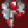

_Task Force_ has room for 5 player squad members and 45 enemies/hostages. 42
bytes are reserved for each individual. The same data structures are used for
both player and enemies, but some stats are only relevant to enemies.

1. Table of Contents
{:toc}

### Data

Each player or enemy stores the following data:

Byte| Size | Field
----|------|-------------------------------------------
0   | word | Sprite
2   | word | X coord
4   | word | Y coord
6   | byte | Terrain type soldier is standing on
7   | byte | Enemy moving or not
8   | word | Endurance
10  | word | Cash
12  | word | Combat Skill
14  | word | Mobility
16  | word | Defence Factor
18  | word | Alertness
20  | word | Initiative
22  | word | Movement left
24  | word | Active weapon
26  | word | Target X coord
28  | word | Target Y coord
30  | long | mapaddr
34  | byte | Weapon 1
35  | byte | Weapon 2
36  | byte | Weapon 3
37  | byte | Weapon 4
38  | byte | Weapon 5
39  | byte | Weapon 6
40  | byte | Weapon 7
41  | byte | Weapon 8

### Starting stats

Player characters and enemies have the same stats, calculated the same way:

Endurance
:  Randomly generated in the range 2-6. Hit points. Weapons deal fixed damage.

Cash
:  Randomly generated in the range 3-8.

Combat Skill
:  Randomly
generated in the range 3-10. Attacking with the Lasight SMG gives a +5 bonus to
Combat Skill.

Mobility
:  Randomly generated in the
range 2-7. The number of squares you can move.

Defence Factor
:  For squad
members, randomly generated in the range 1-3. Body Armour increases this by 1, 2
or 3, to a maximum of 5. For enemies, it instead ranges from -1 to 2 based on
the difficulty setting (see [Difficulty](#difficulty), below), and Body Armour
worn by enemies has no effect. In any case, Defense Factor effectively reduces
the enemy's Combat Skill when calculating a hit.

Alertness
: Randomly generated in the range 3-12. Only used for enemies. Determines the
range at which they will react to squad members.

Initiative
: Randomly generated in the range 1-8, with a bias toward average values.
Actually generates a number from 2-7, then has an even chance to add one,
subtract one, or do nothing. This creates a 1/6 chance of a 3, 4, 5 or 6;
a 1/9 chance each of a 2 or 7, and a 1/18 chance of a 1 or 8.
Only used for enemies. Determines how likely they are to act when a squad
member is spotted.

### Enemy types

The enemy types differ by appearance and equipment loadout.

Normal
:  Randomly has one of: Pistol, Machine Gun, or Lasight SMG. Also has a grenade.

Big Gun
:  Randomly has either a Bazooka with three shells, or a Plasma Gun.

Elite
:  Randomly has one of: Machine Gun, Lasight SMG, or Accurifle. Also has a knife and Body Armour 1.

Android
:  Randomly has two of any weapons, other than Bazooka. Additionally, has a grenade and Body Armour 1.

Captain
:  Always has a pistol and Body Armour 2.

### Difficulty

The game has four difficulty settings: Easy, Normal, Hard, and Mega. The only
differences are enemy stats and score.

All seven enemy stats are modified as follows:

- Easy: -1
- Normal: +0
- Hard: +1
- Mega: +2

The exception is Defence Factor, which is set exactly to that value; e.g. on
Mega difficulty, all enemies will have a Defence Factor of 2. 

### Combat mechanics

Range affects accuracy, as mentioned in the Instructions. The difference between
the shooter and target's X coordinates is added to the difference in their Y
coordinates. This is then halved (rounding down) and 2 is subtracted:

 Range  | Penalty
--------|---------
      1 | -2
    2-3 | -1
    4-5 |  0
    6-7 | +1
    8-9 | +2
  10-11 | +3

A random number is rolled between 1 and 8. The target's Defence Factor and the
range penalty are added. This is compared to the attacker's Combat Skill to
determine a hit. If the Combat Skill is higher, it's a hit.

On a hit, the target's Endurance is reduced by the weapon's fixed damage value.

Explosives (Bazooka, Hand Grenade, Remex Explosive) automatically hit everyone
in the blast radius. Remex is specially coded to deal 20 damage instead of the
listed 10. However, the maximum Endurance for an enemy on Mega difficulty is 8,
so this doesn't seem like an issue.

### Score

- 25 points for every hit on an enemy
- 150 points for every mine detected
- 200 points for every enemy killed
- 500 points for beating the mission
- 2,000 points for each difficulty category above Easy

### Weapon stats

The weapon stats are the same as mentioned on the game's buy screen, but here
they are for completeness.

Weapon            |Cost|Range|Damage
------------------|----|-----|------
Bazooka           |  3 |   6 |   4
Remex Explosive   |  2 |   0 |  10
Hand Grenade      |  1 |   5 |   5
Pistol            |  1 |   7 |   1
Machine Gun       |  2 |   5 |   2
Lasight SMG       |  3 |   5 |   2
Accurifle         |  2 |  10 |   1
Plasma Gun        |  3 |   4 |   4
Knife             |  1 |   0 |   4
Mine Detector     |  1 |   0 |   0
Body Armour 1     |  1 |   0 |   0
Body Armour 2     |  2 |   0 |   0
Body Armour 3     |  3 |   0 |   0

For the purpose of firing, a range of 0 means the square vertically or
horizontally next to the attacker, and each square further away is one. However,
the range calculation for damage appears to count the actual number of squares,
so that the square adjacent to the attacker is 1 away.

The range penalty for Accurifle means that it will often miss when used at the
extent of its range, and the amount of damage it deals will almost never kill an
enemy in one hit.

Mines deal 8 damage, which is enough to kill any of the player's squad in one
hit.
