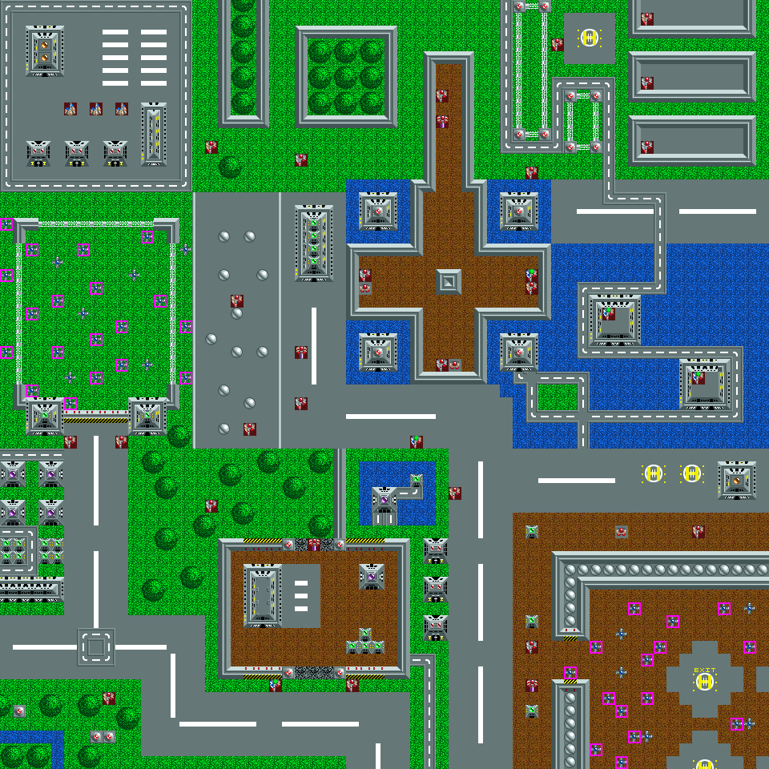

There are eight mission files named `Mission1` to `Mission8`.

1. Table of Contents
{:toc}

### Key

In the mission maps below:

- Mines with magenta borders represent hidden mines.
- Squares with yellow borders represent an objective which must be blown up or
  killed.

### Mission 1

```
      OPERATION  SPRING      
allied general bob stephenson
has been captured by enemy   
forces during an assault on a
transportation convoy.       
your team has been assigned  
to instigate his release by  
destroying the north wall of 
the building where he is now 
being held.                  
the area is mined, so caution
is advised.                  
```

**Win condition**: Destroy 1 block at 48, 29.

<br>Mission 1
{:.center}

### Mission 2

```
     OPERATION LIBERATOR     
you have been assigned to    
liberate the nearby prisoner 
or war camp at oldhaven. blow
open the door in the south   
wall to release the prisoners
then proceed to the helipad  
in the northwest quadrant.   
access to the walls is far   
from easy due to the moat and
minefields around the prison 
perimeter.                   
```

**Win condition**: Destroy one block at 35, 21.

<br>Mission 2
{:.center}

### Mission 3

```
    OPERATION BLUNDERBUSS    
the enemy occupied seaport of
bobchester is causing a      
severe disruption to our oil 
supply lines. the front line 
troops are losing transport  
due to this and the conflict 
is going badly. no artillery 
can be spared, so your team  
must enter the town and wipe 
out all of the enemy troops  
one by one.                  
```

**Win condition**: Kill all enemies.

<br>Mission 3
{:.center}

### Mission 4

```
    OPERATION DEACTIVATOR    
a new enemy cyborg, nicknamed
the deactivator is about to  
be tested for the first time.
the cyborg is bullet proof   
and must be blown up with    
explosives. also the research
buildings in the southwest   
should be destroyed. 4 labs  
are present but only the     
correct two need be destroyed
good luck.                   
```

**Win condition**: Destroy 3 blocks at 47, 45; 4, 49; and 10, 55.
(The Deactivator counts as a destructable block rather than a soldier)

<br>Mission 4
{:.center}

### Mission 5

```
     OPERATION AIRSTRIKE     
an allied bombing raid on the
main enemy factory cities is 
planned for tonight. the only
thing stopping them is the   
presence of a protection dome
energy shield, which must be 
destroyed by blowing the four
main generators. a radio hut 
in the northwest must also be
destroyed to prevent an early
warning of the attack.       
```

**Win condition**: Destroy 5 blocks at 5, 4; 37, 20; 37, 14; 26, 14; and 26, 20.

<br>Mission 5
{:.center}

### Mission 6

```
      OPERATION  ESCAPE      
due to an aircraft navigation
error, three team members,   
willis, moore and tyler were 
given the jump light while on
enemy territory. you must    
guide these three to the exit
to complete the mission. the 
other team members are not   
present in the mission so you
don:t have to equip them.    
mines are present in the area
```

**Win condition**: No objective, just reach the exit.

<br>Mission 6
{:.center}

### Mission 7

```
    OPERATION  CAMP STEEL    
training camp steel based at 
pine gorge is where the most 
elite of elite guards are put
to the test. a reunion for 6 
graduates has been arranged  
for today. if the guards, and
their android trainer could  
be taken out it would be an  
enormous moral boost, as well
as a strategic one. mission =
assasinate the 7 guards.     
```

**Win condition**: Defeat 7 enemies numbered 8, 9, 11, 11, 12, 13 and 14.

<br>Mission 7
{:.center}

### Mission 8

```
     OPERATION  ASSASSIN     
the enemy high commander is  
paying a secret visit to a   
new fort in the south of an  
occupied city. your team has 
been selected to assasinate  
him. he is currently in an   
enclosed bunker to the south 
within the fort walls.       
your exit point is an enemy  
helipad in the northwest. it 
is under moderate guard.     
```

**Win condition**: Defeat one enemy numbered 22.

<br>Mission 8
{:.center}

### Map format technical data

Each mission file is 4,000 bytes, divided into five sections:

Length | Format           | Field
-------|------------------|-----------------------------------
    2  | 2 bytes          | Win condition
    2  | 2 bytes          | Always zero
   36  | 9 x 2 x 2 bytes  | Coordinates for mission targets.
  360  | 12 x 30 bytes    | Description. First line is title.
 3600  | 60 x 60 bytes    | Map, one byte per tile.

The first two bytes determine the win condition. They are read as a big-endian
two-byte word:

- If negative, it is the number of buildings you must destroy. In this case, the
  36 bytes are nine pairs of coordinates for the targets.
- If positive, it is the number of enemies you must kill. The 36 bytes are 36
  separate ID numbers of enemies, numbered in order they are added to the
  screen.
- If equal to `$ACED`, the mission is already complete and you need only proceed
  to the exit.

The 360 bytes which follow are the map description in twelve 30-byte lines, each
line ending with `$00`. The first line of these is the mission title.

The remaining 3600 bytes is a 60x60 map. There are 72 tiles from `01` to `72`,
depicted below as rows of 10 starting at 0.

{: width="320px"}<br>TF-Tiles.gfx
{:.center}
