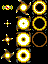

### TF-Armour.gfx

 TF-Armour.gfx
{:.center}

### TF-Key.gfx

 TF-Key.gfx
{:.center}

### TF-Maintitle.gfx

 TF-Maintitle.gfx
{:.center}

This is actually unused. The game source never loads it. An identical graphic is
used on the title screen, but it's part of the title screen background image
`TF-Title.pack`.

### TF-Masktiles2.gfx

 TF-Masktiles2.gfx
{:.center}

### TF-Masktiles.gfx

 TF-Masktiles.gfx
{:.center}

### TF-Options.gfx

 TF-Options.gfx
{:.center}

### TF-Panel2.gfx

 TF-Panel2.gfx
{:.center}

### TF-Paneledge.gfx

 TF-Paneledge.gfx
{:.center}

### TF-Panel.gfx

 TF-Panel.gfx
{:.center}

### TF-Panelweps.gfx

 TF-Panelweps.gfx
{:.center}

### TF-Photos.gfx

 TF-Photos.gfx
{:.center}

### TF-Tiles.gfx

 TF-Tiles.gfx
{:.center}

### TF-Weapons.gfx

 TF-Weapons.gfx
{:.center}

### TF-Missionscreen.pack

 TF-Missionscreen.pack
{:.center}

The mission screen is 9,691 bytes, but in the
[deleted files](../analysis/deleted-files.html), `TF-Instructs.s` references an
earlier version of this file which was only 9,357 bytes. Additional detail must
have been added to the image at some point late in development.

### TF-Teamscreen.pack

 TF-Teamscreen.pack
{:.center}

### TF-Title.pack

 TF-Title.pack
{:.center}
